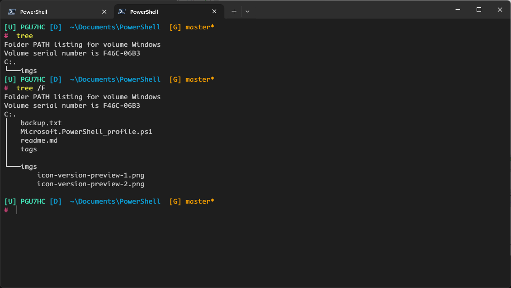
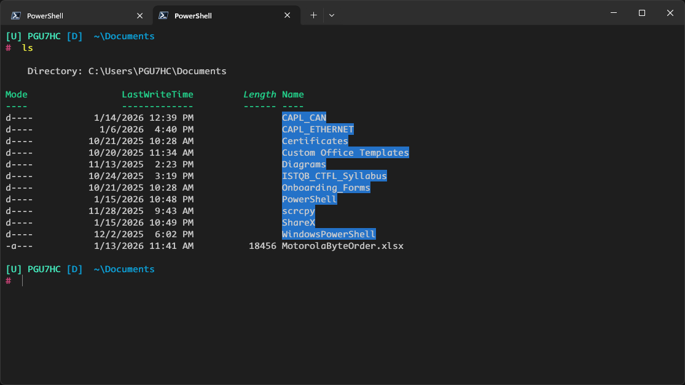
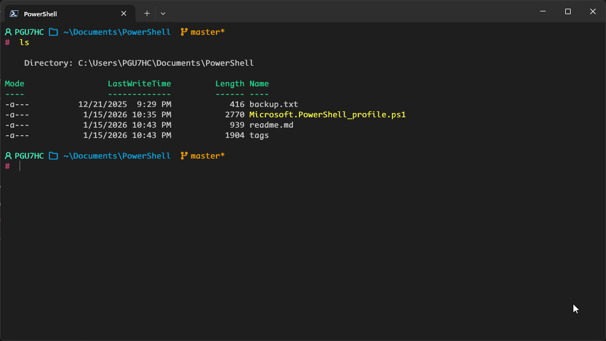
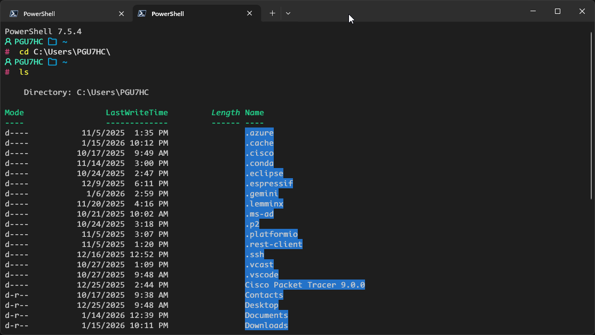

# About

This repo was made to enhance Microsoft PowerShell visuals without installing any third-party applications (like Oh My Posh or Starship). It uses native PowerShell functions to keep startup time extremely fast.

# Preview

## no-icon-version

*(Suitable for standard fonts like Consolas)*




## icon-version 




# Set-up

**Disclaimer**: I assume NO responsibility for any issues caused by this script! Please read the code carefully and use it at your own risk.

**Prerequisites**:
- Windows 10/11 (for ANSI color support).
- PowerShell 7 recommended (though works on newer Windows PowerShell 5.1 builds).

**Installation**:

1. Open your PowerShell profile by running this command in Terminal:

```powershell
if (!(Test-Path $PROFILE)) { New-Item -Type File -Path $PROFILE -Force }
notepad $PROFILE
```

2. Copy one of the scripts below (Icon or No-Icon) and paste it into the Notepad window.

3. Save and restart your Terminal.

**NOTES:**
- Backup: Always backup your current profile content before replacing it.
- Conda Users: The script includes a "Lazy Load" feature for Conda to speed up startup. CHECK THE PATH in the Conda Configuration section to match your installation (Miniconda/Anaconda).
- Fonts: For the Icon Version, your Terminal must be configured to use a Nerd Font (e.g., CaskaydiaCove NF, MesloLGS NF).
- 

## no-icon-version

```
# Enable the Progress Bar
$ProgressPreference = 'Continue'

# --- HELPER FUNCTION: Convert HEX to ANSI Color ---
function Hex ($hex) {
    $hex = $hex.Trim('#')
    $r = [Convert]::ToByte($hex.Substring(0,2), 16)
    $g = [Convert]::ToByte($hex.Substring(2,2), 16)
    $b = [Convert]::ToByte($hex.Substring(4,2), 16)
    return "$([char]0x1b)[38;2;$r;$g;${b}m"
}

# Reset color code
$Reset = "$([char]0x1b)[0m"

function prompt {
    $user = $env:USERNAME
    $path = $(Get-Location).Path

    # Shorten home directory to "~"
    if ($path.StartsWith($HOME)) {
        $path = $path.Replace($HOME, "~")
    }

    # Check for Administrator privileges
    $isAdmin = ([Security.Principal.WindowsPrincipal] [Security.Principal.WindowsIdentity]::GetCurrent()).IsInRole([Security.Principal.WindowsBuiltInRole]::Administrator)

    # --- 1. RENDER USER ---
    if ($isAdmin) {
        Write-Host "$(Hex '#FF5555')[U] $user $Reset" -NoNewline
    } else {
        Write-Host "$(Hex '#45F1C2')[U] $user $Reset" -NoNewline
    }
    
    # --- 2. RENDER PATH ---
    Write-Host "$(Hex '#0CA0D8')[D]  $path $Reset" -NoNewline

    # --- 3. RENDER GIT ---
    $gitBranch = git branch --show-current 2>$null
    if ($gitBranch) {
        $gitStatus = git status --porcelain 2>$null
        if ($gitStatus) {
            # Dirty: Orange (#FFA500)
            Write-Host " $(Hex '#FFA500')[G] $gitBranch* $Reset" -NoNewline
        } else {
            # Clean: Light Blue (#57C7FF)
            Write-Host " $(Hex '#57C7FF')[G] $gitBranch $Reset" -NoNewline
        }
    }

    Write-Host "" 

    # --- 4. RENDER PROMPT SYMBOL ---
    if ($isAdmin) {
        Write-Host "$(Hex '#FF5555')# $Reset" -NoNewline
    } else {
        Write-Host "$(Hex '#CD4277')# $Reset" -NoNewline
    }

    return " "
}

# --- OPTIMIZED CONDA INIT (LAZY LOAD) ---
# EDIT THIS PATH IF YOUR CONDA IS INSTALLED ELSEWHERE
$CondaExe = "$env:USERPROFILE\AppData\Local\miniconda3\Scripts\conda.exe"

if (Test-Path $CondaExe) {
    function conda {
        Write-Host "Initializing Conda... (Lazy Load)" -ForegroundColor DarkGray
        (& $CondaExe "shell.powershell" "hook") | Out-String | Invoke-Expression
        conda @args
    }
}
```

## icon-version

```
# Enable the Progress Bar
$ProgressPreference = 'Continue'

# --- HELPER FUNCTION: Convert HEX to ANSI Color ---
function Hex ($hex) {
    $hex = $hex.Trim('#')
    $r = [Convert]::ToByte($hex.Substring(0,2), 16)
    $g = [Convert]::ToByte($hex.Substring(2,2), 16)
    $b = [Convert]::ToByte($hex.Substring(4,2), 16)
    return "$([char]0x1b)[38;2;$r;$g;${b}m"
}

# Reset color code
$Reset = "$([char]0x1b)[0m"

function prompt {
    $user = $env:USERNAME
    $path = $(Get-Location).Path

    # Shorten home directory to "~"
    if ($path.StartsWith($HOME)) {
        $path = $path.Replace($HOME, "~")
    }

    # Check for Administrator privileges
    $isAdmin = ([Security.Principal.WindowsPrincipal] [Security.Principal.WindowsIdentity]::GetCurrent()).IsInRole([Security.Principal.WindowsBuiltInRole]::Administrator)

    # --- 1. RENDER USER ---
    if ($isAdmin) {
        Write-Host "$(Hex '#FF5555') $user $Reset" -NoNewline
    } else {
        Write-Host "$(Hex '#45F1C2') $user $Reset" -NoNewline
    }
    
    # --- 2. RENDER PATH ---
    Write-Host "$(Hex '#0CA0D8')  $path $Reset" -NoNewline

    # --- 3. RENDER GIT ---
    $gitBranch = git branch --show-current 2>$null
    if ($gitBranch) {
        $gitStatus = git status --porcelain 2>$null
        if ($gitStatus) {
            # Dirty: Orange (#FFA500)
            Write-Host " $(Hex '#FFA500') $gitBranch* $Reset" -NoNewline
        } else {
            # Clean: Light Blue (#57C7FF)
            Write-Host " $(Hex '#57C7FF') $gitBranch $Reset" -NoNewline
        }
    }

    Write-Host "" 

    # --- 4. RENDER PROMPT SYMBOL ---
    if ($isAdmin) {
        Write-Host "$(Hex '#FF5555')# $Reset" -NoNewline
    } else {
        Write-Host "$(Hex '#CD4277')# $Reset" -NoNewline
    }

    return " "
}

# --- OPTIMIZED CONDA INIT (LAZY LOAD) ---
# EDIT THIS PATH IF YOUR CONDA IS INSTALLED ELSEWHERE
$CondaExe = "$env:USERPROFILE\AppData\Local\miniconda3\Scripts\conda.exe"

if (Test-Path $CondaExe) {
    function conda {
        Write-Host "Initializing Conda... (Lazy Load)" -ForegroundColor DarkGray
        (& $CondaExe "shell.powershell" "hook") | Out-String | Invoke-Expression
        conda @args
    }
}
```
